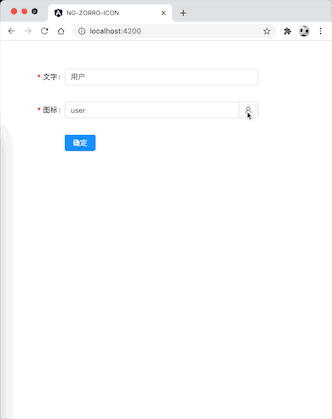

# ng-zorro-icon

[](https://www.npmjs.com/package/ng-zorro-icon)

[NG-ZORRO](https://github.com/NG-ZORRO/ng-zorro-antd) 的图标选择器。



## 依赖

| ng-zorro-icon | Angular | NG-ZORRO |
| ------------- | ------- | -------- |
| 8.x           | 8.x     | 8.x      |
| 9.x           | 9.x     | 9.x      |


## Install - 安装

```bash
npm install ng-zorro-icon
```


## Usage - 使用

### 引入模块

```typescript
import {NziPickerModule} from 'ng-zorro-icon';

@NgModule({
  declarations: [
    AppComponent
  ],
  imports: [
    // ...
    BrowserAnimationsModule,
    HttpClientModule,
    // 引入模块
    NziPickerModule
  ],
  providers: [],
  bootstrap: [AppComponent]
})
export class AppModule {
}
```

### Simple usage - 简单用法

```html
<nzi-picker [(ngModel)]="icon"></nzi-picker>
```

### Used in a form - 在表单中使用

```html
  <form nz-form [formGroup]="validateForm" (ngSubmit)="submitForm()">
    <nz-form-item>
      <nz-form-label [nzSpan]="6" nzRequired>文字</nz-form-label>
      <nz-form-control [nzSpan]="18" [nzErrorTip]="'请输入文字'">
        <input nz-input formControlName="text">
      </nz-form-control>
    </nz-form-item>
    <nz-form-item>
      <nz-form-label [nzSpan]="6" nzRequired>图标</nz-form-label>
      <nz-form-control [nzSpan]="18" [nzErrorTip]="'请选择图标'">
        <nzi-picker formControlName="icon"
                    (ngModelChange)="valueChange($event)"
                    (nziOnPicked)="onPicked($event)"
        ></nzi-picker>
      </nz-form-control>
    </nz-form-item>
    <nz-form-item>
      <nz-form-control [nzSpan]="18" [nzOffset]="6">
        <button nz-button [nzType]="'primary'">确定</button>
      </nz-form-control>
    </nz-form-item>
  </form>
```


## API

### [nzi-picker] - `COMPONENT`

| 参数                | 说明              | 类型                   | 默认值  |
| ------------------ | ----------------- | ---------------------- | ------- |
| `[ngModel]`        | 图标名称            | `string`               | `-`     |
| `[nziAllowClear]`  | 是否显示清除按钮     | `boolean`              | `false` |
| `[nziAllowTypeIn]` | 是否允许输入图标名称  | `boolean`              | `true` |
| `[nziPlaceHolder]` | 选择框默认文字       | `string`               | `-`     |
| `(ngModelChange)`  | 图标名称发生变化的回调 | `EventEmitter<string>` | `-`     |
| `(nziOnPicked)`    | 通过弹框选择图标的回调 | `EventEmitter<string>` | `-`     |

